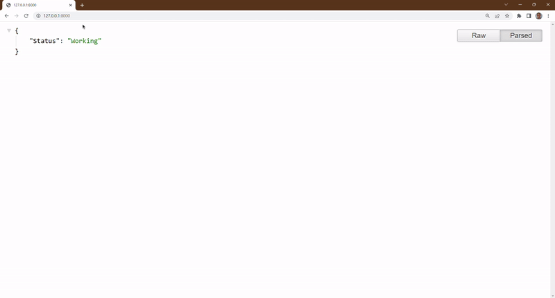

# E-Commmerce-Recommender
> E-Commerce-Recommender is a recommendation system that aims to help users find similar items to the ones they bought from a retail store. <br> It does this using two components. A CLIP and Dot NN component. The CLIP part uses pretrained embeddings from the CLIP Text Model and the Dot NN part uses trained-from-scratch embeddings.

# Model Architecture (Dot NN)


# Built Using
- [Python](https://python.org)
- [PyTorch](https://pytorch.org/)
- [Hugging Face](https://huggingface.co/)
- [FastAI](https://www.fast.ai/)
- [CLIP](https://github.com/openai/CLIP)
- [FastAPI](https://fastapi.tiangolo.com/)
- Others

# Prerequisites and Installation
- Python
```
python -m pip install -r requirements.txt
```
- FastAPI
```
uvicorn main:app
```

# Project Structure
```
│   main.py
│   train.ipynb
│   utils.py    
|
├── variables
│   ├──all_items.pt
│   ├──df.pt
|   └──weights.pt
|
└── images
    └─── model_architecture.png
```
# Usage
Running the code mentioned above should launch a server in your localhost with some port. Head over to "bought" page and supply an index. Example:
> localhost:8000/bought/1234

# Demo


# References
- [Learning Transferable Visual Models From Natural Language Supervision](https://scholar.google.com/scholar_lookup?arxiv_id=2103.00020)

# Contact

Dahir Ibrahim (Deedax Inc) - http://instagram.com/deedax_inc <br>
Email - suhayrid@gmail.com <br>
YouTube - https://www.youtube.com/@deedaxinc.3389 <br>
Twitter - https://twitter.com/DeedaxInc <br>
Project Link - https://github.com/Daheer/E-Commerce-Recommender
